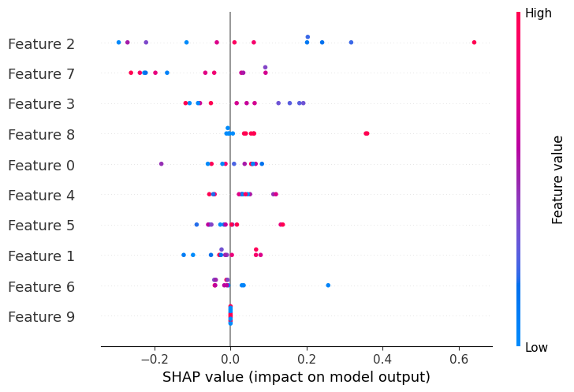

# Sleep Deprivation & Cognitive Performance Predictor  
Predict Stroop Task reaction time using sleep and lifestyle metrics.

## Demo  
[](https://your-streamlit-app-url.com)  

## Features  
- XGBoost regression model (R²: 0.85).  
- SHAP explainability for feature importance.  
- Streamlit web app for real-time predictions.  

## Installation  
1. Clone the repo:  
   ```bash
   git clone https://github.com/yourusername/sleep-cognition-predictor.git
   cd sleep-cognition-predictor
2. Install dependencies:
   pip install -r requirements.txt
3. Run the app:
   streamlit run app/app.py

## Results  
  
*Features impacting cognitive performance (higher SHAP = greater influence).*  
